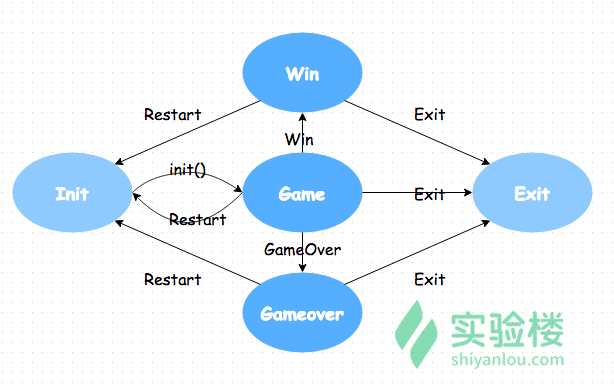
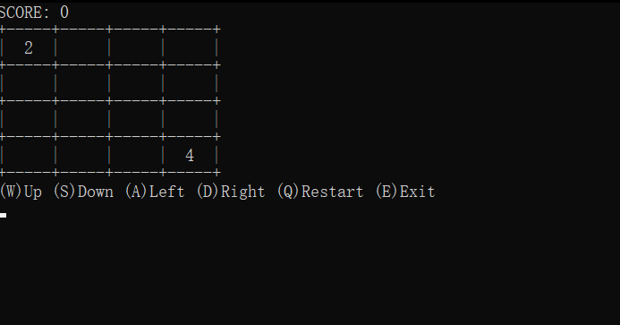

# Python实现2048

## 用户行为

游戏中有效输入包括 "上、下、左、右、重置、退出", 用actions表示：

actions = ['Up', 'Left', 'Down', 'Right', 'Restart', 'Exit']

有效输入键是最常见的 W（上），A（左），S（下），D（右），R（重置），Q（退出），这里要考虑到大写键开启的情况，获得有效键值列表：

```python
# ord() 函数以一个字符作为参数，返回参数对应的 ASCII 数值，便于和后面捕捉的键位关联 
# 此处用到python列表解析的方法，更便捷得到一个列表
letter_codes = [ord(ch) for ch in 'WASDRQwasdrq']
```

将输入与行为进行关联：

```python
actions_dict = dict(zip(letter_codes, actions * 2))
#zip()函数将两个列表对应匹配，便于生成字典
#actions*2，将action复制一遍再加到actions中
# actions_dict 的输出结果为
{87: 'Up', 65: 'Left', 83: 'Down', 68: 'Right', 82: 'Restart', 81: 'Exit', 119: 'Up', 97: 'Left', 115: 'Down', 100: 'Right', 114: 'Restart', 113: 'Exit'}
```

## 用户输出处理：

堵塞 + 循环， 直到用户获得有效输入才返回对应行为：

```python
def get_user_action(keyboard):    
    char = "N"
    while char not in actions_dict:  
        # 返回按下键位的 ASCII　码值
        char = keyboard.getch()
    # 返回输入键位对应的行为
    return actions_dict[char]
```


## 状态机

处理游戏主逻辑的时候我们会用到一种十分常用的计数： 状态机

2048的游戏可以很容易的分解成几种状态的转换：



`state` 存储当前状态， `state_actions` 是个字典，作为状态转换的规则，它的 key 是状态，value 是状态的函数：

主逻辑伪代码：

```python
def main(stdscr): # 参数暂且不管，后面会详细说明

    def init():
        reset()
        return 'Game'
    
    def game():
        draw(stdscr) # 绘制游戏界面
        global actions_dict
        action = get_user_action(stdscr)
        if action == 'Restart':
            return 'Init'
        elif action == 'Exit':
            return 'Exit'
        else: 
            move(action) # 根据命令移动
            if is_win():
                return 'Win'
            if is_gameover():
                return 'Gameover'
        return 'Game'

    def gameover():
        draw(stdscr)
        action = get_user_action(stdscr)
        if action == 'Restart':
            return 'Init'
        elif action == 'Exit':
            return 'Exit'
        else:
            return 'Gameover'

    def win():
        draw(stdscr)
        action = get_user_action(stdscr)
        if action == 'Restart':
            return 'Init'
        elif action == 'Exit':
            return 'Exit'
        else:
            return 'Win'

    state_actions = {
        'Init': init,
        'Win': win,
        'Gameover': gameover,
        'Game': game
    }

    state = 'Init'
    #状态机开始循环
    while state !='Exit':
        state = state_actions[state]() # 字典的值作为函数名
```

## 游戏处理

### 随机生成一个2 或者4

```python
def spawn(self):
    #十分之一概率取4，十分之九概率取2
    new_value = 2 if random.randrange(10) >= 1 else 4
    # 向一个随机位置添加空白位置的元组坐标
 	(i, j) = random.choice([(i, j) for i in range(width) for j in range(height) if game_field[i][j] == 0 ])
    game_field[i][j] = new_value
```

### 重置棋盘

将棋盘所有元素复原为0，然后再在随机位置生成游戏初始的数值

```python
def reset(self):
    #更新分数
    #初始化游戏二维数组
    #随机生成两个单元
    score = 0
    game_field = [[0 for i in range(width)] for j in range(height)]
    spawn()
    spawn()
```


### 单元移动

#### 一行向左合并

```python
def move_row_left(row): 
    def tighten(row):   #将零散的单元挤到一块
        # 先将非零的元素全拿出来加入到新列表
        # 按照原列表的大小，给新列表补零
        new_row=[val for val in row if val != 0]
        while len(new_row) < 4:
            new_row.append(0)
        return new_row
         
    def merge(row): #对邻近元素进行合并
        i = 0
        while i < len(row) - 1:  #遍历一行，进行相应修改即可
            if row[i] == row[i+1]:
                row[i] = row[i+1] * 2
                row[i+1] = 0
                i += 2
            else:
                i += 1
        return row
    
    #移动一次，先挤到一块再合并再挤到一块
    return tighten(merge(tighten(row)))    
        
```

#### 其他方向合并

利用矩阵逆转和矩阵转置的操作，可以将其他方向的移动都转换为向左移动，从而减少代码量

- 向右合并，可利用矩阵逆转(每一行序列倒序)，再进行一行向左合并，最后再将所得矩阵逆转回来，

- 向上合并，可利用矩阵转置，再进行向左合并，最后再将矩阵转置回来

- 向下合并，可利用矩阵转置后再逆转，再进行一行向左合并，最后将矩阵先逆转再转置回来

```python
def transpose(field):
	#矩阵转置，利用列表生成式以及zip(*)操作
    return [list(row) for row in zip(*field)]
    
```

```python
def invert(field):
    #矩阵逆转，利用列表生成式以及切片
    return [row[::-1] for row in field]
```

单元移动逻辑代码：

```python
if move_is_possible(direction): # 判断某方向能否移动，见下面详述
    if direction == 'Left':
        game_field = [move_row_left(row) for row in game_field]
    elif direction == 'Right':
        game_field = invert([move_row_left(row) for row in invert(game_field)])
    elif direction == 'Up':
        game_field = transpose([move_row_left(row) for row in transpose(game_field)])
    elif direction == 'Down':
        game_field = transpose(invert([move_row_left(row) for row in invert(transpose(game_field))]))
    spawn() # 移动成功即新生成单元
```


#### 判断某方向能否移动

```python
def move_is_possible(direction):
    def left_move_is_possible(field): # 向左移动
        for row in field:
            for i in range(len(row) - 1):
                if row[i] == 0 and row[i+1]!=0:
                    return True
                elif row[i] !=0 and row[i] == row[i+1]:
                    return True
        return False
    # 与单元移动类似，通过转置或逆转矩阵的方式减少代码量
    if direction == 'Left':
        return left_move_is_possible(game_field)
    elif direction == 'Right':
        return left_move_is_possible(invert(game_field))
    elif direction == 'Up':
        return left_move_is_possible(transpose(game_field))
    elif direction == 'Down':
        return left_move_is_possible(invert(transpose(game_field)))
```

#### 

```python
def is_win(self):
    # 任意一个位置的数大于设定的 win 值时，游戏胜利
    return any(any(i >= self.win_value for i in row) for row in self.field)

def is_gameover(self):
    # 无法移动和合并时，游戏失败
    return not any(self.move_is_possible(direction) for direction in actions)
```

### 绘制游戏界面

游戏界面需要大家花时间去试，看懂逻辑即可

```python
def draw(stdscr): # 参数先不管，见下面详述
    help_string = '(W)Up (S)Down (A)Left (D)Right (Q)Restart (E)Exit'
    gameover_string = '        GAMEOVER' + '\n' + '    (Q)Restart (E)Exit'
    win_string = '        YOU WIN' + '\n' + '    (Q)Restart (E)Exit'

    def print_str(string):
        stdscr.addstr(string + '\n')
       
    stdscr.clear() #每一次移动更新
    print_str('SCORE: ' + str(score))

    for row in game_field:
        print_str('+-----' * 4 + '+')  #绘制横框
        print_str(''.join('|{:^5}'.format(val) if val!=0 else '|     ' for val in row) + '|' ) #绘制竖框以及数字，注意字符串join函数和字符串格式化输出的用法
    print_str('+-----' * 4 + '+')

    if is_win():
        print_str(win_string)
    elif is_gameover():
        print_str(gameover_string)
    else:
        print_str(help_string)
```


## curses库绘制界面的用法

将主逻辑代码再放一遍方便理解：

```python
def main(stdscr):

    def init():
        reset()
        return 'Game'
    
    def game():
        draw(stdscr)
        global actions_dict
        action = get_user_action(stdscr)
        if action == 'Restart':
            return 'Init'
        elif action == 'Exit':
            return 'Exit'
        else: 
            move(action)
            if is_win():
                return 'Win'
            if is_gameover():
                return 'Gameover'
        return 'Game'

    def gameover():
        draw(stdscr)
        action = get_user_action(stdscr)
        if action == 'Restart':
            return 'Init'
        elif action == 'Exit':
            return 'Exit'
        else:
            return 'Gameover'

    def win():
        draw(stdscr)
        action = get_user_action(stdscr)
        if action == 'Restart':
            return 'Init'
        elif action == 'Exit':
            return 'Exit'
        else:
            return 'Win'

    state_actions = {
        'Init': init,
        'Win': win,
        'Gameover': gameover,
        'Game': game
    }

    state = 'Init'
    #状态机开始循环
    while state !='Exit':
        state = state_actions[state]()

if __name__ == "__main__":
    curses.wrapper(main)
```

可以看到程序从`curses.wrapper(main)`处开始运行

首先， `curses.wrapper` 函数会激活并初始化终端进入 'curses 模式'。
在这个模式下会禁止输入的字符显示在终端上、禁止终端程序的行缓冲（line buffering），即字符在输入时就可以使用，不需要遇到换行符或回车。

接着，`curses.wrapper` 函数需要传一个函数作为参数，这个传进去的函数必须满足第一个参数为主窗体（main window） `stdscr`。 在前面的代码里，可以看到我们给 `curses.wrapper(main)` 的 `main` 函数中传入了一个 `stdscr`。

最后，`stdscr` 作为 `window.addstr(str)`、`window.clear()` 方法的调用需要窗体对象（window object），在 `draw(stdscr)` 中传入 `draw` 方法，完成绘制中。

具体关于curses库的用法可参考https://docs.python.org/zh-cn/3/howto/curses.html#curses-howto


## 运行

linux和mac环境下可直接运行。

windows环境下运行，需要安装windows平台下的curses库，安装方法见https://www.cnblogs.com/hardcoreYutian/p/11270871.html。安装完毕之后，最好直接在系统命令行(cmd)中运行，运行方式：键入python空格，然后直接将该程序文件拖到命令行，按下回车即可。 在相关IDE中运行可能出现一系列问题。

结果:




## 项目总结

采用有限状态机的思想，用 Python 的 curses 库在终端实现了一个 2048 规则的图形界面小游戏。熟悉了 random 库函数 randrange、choice，等python内置函数的使用

感想：

- curses库对windows不太友好，可能出现一系列bug，耐心搜索解决

- 注意python在局部作用域对全局变量的使用方式，需要先`global + 变量名`表示对全局变量的声明

- 注意列表表达式、生成器表达式的使用，可以极大减少代码量

  